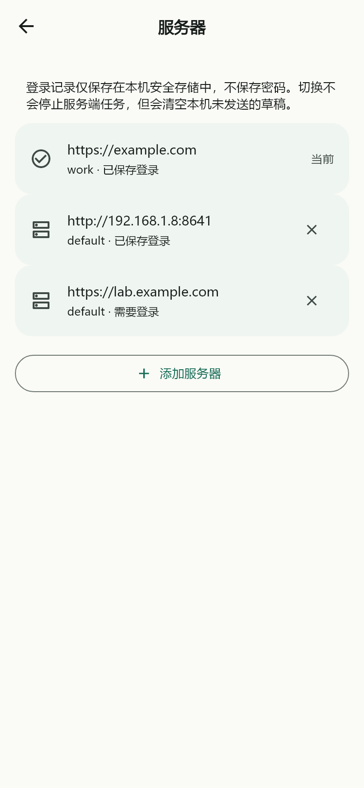
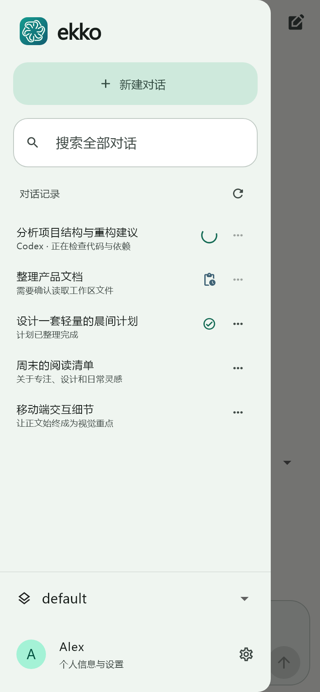
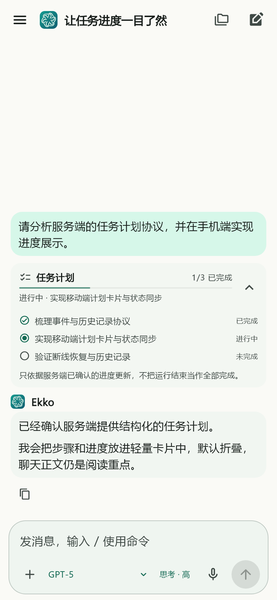
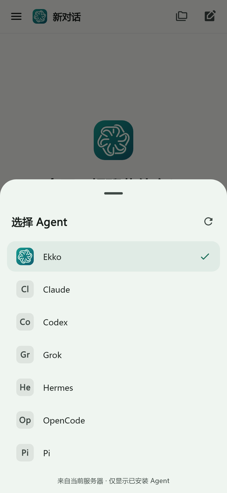
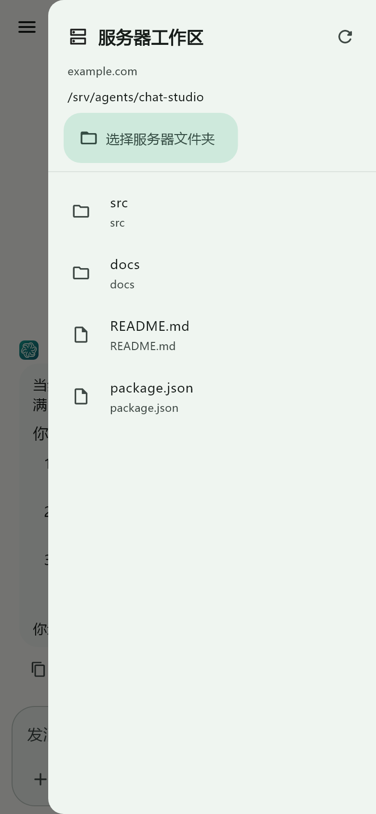
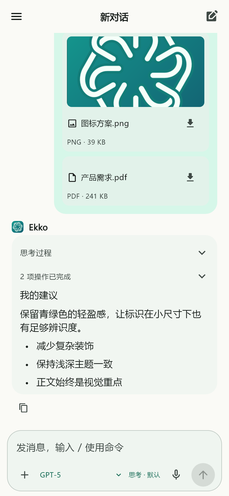

# Chat Studio

[English](README.en.md) | [中文](README.md)

A lightweight Hermes Studio client for Android and iOS. It implements the real Hermes Studio-compatible protocol with a standalone Flutter UI — **not a WebView wrapper**.

> Current delivery: source for both platforms, a signed Android Release APK, GitHub builds for both platforms, and optional signing workflows. Android has been built locally on Windows. Real service contract checks run on the GitHub Ubuntu runner; iOS still requires validation on a GitHub macOS runner with Xcode; an unsigned `.app` is not presented as an installable IPA.

> The application ID is `ai.chatstudio.app` and the Dart package name is `chatstudio`. This is a new application identity: install it separately and add/sign in to your server again. Server-side history is unaffected. See [build and release](docs/build-release.md) and [naming conventions](docs/naming.md).


Agent management includes native Hermes settings (Agent, memory, sessions and gateway), Runtime downloads/version switching/server directory management, and the built-in Agent's runtime/model/tool/module/advanced settings. Forms use grouped pages and bottom sheets, explicit saves, local refresh and safety confirmations. The single-chat composer shows server context usage while empty and hides it while typing. See [Agent settings and context accounting](docs/agent-runtime-settings.md).

## Features

- Custom server URL, device-bound username/password sign-in, secure session storage, and expiration handling.
- Profile switching, paginated/searchable history, rename, and confirmed deletion.
- Separate single-chat, group-chat, and history tabs. History is grouped by server source with independent pagination, read-only details, import, pin, unarchive, and batch deletion persisted on the server.
- Group chats share single-chat header styling, message rendering, and swipe navigation, with participant icons and @Agent / @all mentions. Configure groups on the Web; browse their server workspace on mobile.
- Multiple active conversations per profile with independent output, approvals, stopping, drafts, attachments, and reading positions.
- Streaming responses, collapsible reasoning, stop/resume after reconnect, message copy, Markdown, and distinct user/AI surfaces.
- Eight reasoning-depth options submitted through the real `run` / `reasoning-effort` API and remembered per server/account/profile.
- Dynamic Agent discovery from the current server with icons, refresh/retry, installed filtering, and protocol-specific routing for built-in Agent, Hermes, Claude, Codex, Pi, Grok, and OpenCode. See [Agent catalog and selection](docs/agent-catalog.md).
- Agent task plans with live progress, expandable step states, history restore, and reconnect deduplication. See [task-plan protocol and implementation](docs/task-plans.md).
- Swipe gestures for chat history and the server workspace; remote workspace paths use the server's `fullPath`, not phone storage paths. See [workspace and gesture notes](docs/workspace-navigation.md).
- Native file/photo selection, image preview, attachment removal, authenticated downloads, and upload progress. Up to 5 attachments, 20 MB each, 40 MB total.
- Native microphone recording sent to server-side STT as an editable draft; recording is limited to 60 seconds and is never auto-sent.
- Tool approval/rejection, clarification prompts, queued messages during generation, slash-command suggestions, skills, and audio attachment playback/download.
- Multi-server records from the login page or **Profile → Server management and switching**. Tokens and Profile choices are isolated per server; passwords are not stored.
- Agent icons and names in conversation headers, full-screen image preview, server-side Agent management, Provider/model management, MCP, STT/TTS, logs, usage, performance, and Profile settings.
- The UI supports **Simplified Chinese and English**. Switch language on the login page or under **Profile → Preferences → Language**; the choice is persisted after restart.

**Scope boundary:** no terminal, workflow editor, group-chat editor, automatic TTS for ordinary text replies, real-time voice calls, push notifications, offline chat cache, cloud relay login, or mobile-side model-key configuration. Configure model keys in the Studio web app.

## Screenshots

The screenshots below are rendered from the current Flutter components with deterministic test data rather than captured from a physical device. Only the key flows are shown here: sign-in, server switching, chat, history/tasks, Agent/model selection, remote workspace, and attachments. See [screenshot notes](docs/screenshots/README.md) for the complete catalog and verification boundary.

<p>
  
  
  
  
  
  
  
  
  
  
</p>

## Technical choices

Flutter **3.44.9** / Dart **3.12.2**, Material 3, platform input methods, secure storage, and native deep links. Release builds use AOT compilation and share protocol/state code across Android and iOS.

- Android: **7.0+ / API 24+**, compile/target SDK 36, JDK 17.
- iOS: project deployment target **15.0+**; signing requires macOS, Xcode, and Apple developer credentials.
- The app UI supports Chinese and English. Device performance, power use, and compatibility with every physical device are not claimed to have been fully validated.

## Quick start

```sh
flutter --version   # use 3.44.9
flutter pub get --enforce-lockfile
flutter analyze
flutter test --coverage
flutter run
```

After launch, enter the **Studio root URL**, for example `https://studio.example.com`, not `/api` or a web subpath. Sign in with the Studio account.

- Public connections must use HTTPS.
- LAN HTTP must be explicitly enabled and is restricted to private/loopback addresses and `.local` hostnames.
- From a phone, use the computer's LAN IP rather than the phone's own `localhost`; Android Emulator commonly uses `10.0.2.2`.
- A reverse proxy must support WebSocket upgrade for `/socket.io/`, not only `/api`.
- The account needs access to the selected Profile. Hermes also requires a working server-side Hermes Runtime; the built-in Ekko engine does not require the Hermes Python Runtime.

**Voice:** TTS is speech synthesis, not STT. Configure and activate server-side STT for the current Profile. The mobile microphone button checks this configuration and reports the reason when it is unavailable.

**Agents:** external Agents must be installed and configured on the server. Installed does not necessarily mean that model credentials or the runtime are usable. The app selects and speaks the protocol; it does not execute CLIs on the phone. Workflow and global-Agent sessions remain read-only. Join group conversations through the dedicated group-chat tab; group configuration remains Web-only. See [server configuration](docs/server-setup.md).

## Android packages

GitHub build outputs are available from the Artifacts of the corresponding Actions run. Local Release output:

```text
build/app/outputs/flutter-apk/app-release.apk
build/app/outputs/bundle/release/app-release.aab
```

APK files can be installed directly; AAB files are for store upload and cannot be installed directly. Signing files under `.local/signing/` and `android/key.properties` must never be committed. Reuse the same signing identity for upgrades.

```sh
flutter build apk --release
flutter build appbundle --release
```

Without `android/key.properties`, Release builds are unsigned and do not silently fall back to a debug key. Use `flutter build apk --debug` for a quick unsigned test. See [signing and automated packaging](docs/build-release.md).

## GitHub Actions

| Workflow | Trigger | Outputs |
|---|---|---|
| `Mobile CI` | push / PR / manual | test coverage, installable debug APK, iOS simulator app, unsigned iOS device app |
| `Signed packages` | manually choose android / ios / both | signed Release APK + AAB / IPA; requires `release` environment secrets |
| `Branch releases` | push/manual for branches other than `main`/`master` | separate APK + AAB assets under a GitHub Release; optionally separate IPA |
| `Studio contract` | manual | real REST + Socket.IO contract checks using local model fixtures |

`Branch releases` uploads each package as an individual Release asset instead of using a single compressed Actions artifact. A branch push creates a prerelease whose title includes the branch name, short commit SHA, and Actions run number. Android branch packages use a one-time CI preview signature and cannot replace a formally signed production package. To produce an installable iOS IPA, configure the iOS signing secrets in the `release` environment and set `BRANCH_RELEASE_IOS=true`, or run the workflow manually with `include_ios` enabled.

## Repository layout

```text
lib/core/                 address validation and LAN policy
lib/data/                 REST, Socket.IO, secure storage, data models
lib/state/                controllers and testable streaming reducers
lib/ui/                   login, chat, history, profile
android/  ios/            platform projects and icons
test/                     unit, widget, and optional live contract tests
tools/mock-provider/      offline OpenAI-compatible test fixture
scripts/                  CI signing, icon generation, source-analysis tools
docs/analysis/            source analysis and CodeGraph output
.github/workflows/        CI and packaging workflows
```

## License, privacy, and upstream relationship

Chat Studio is an independent Flutter third-party client for EKKOLearnAI/hermes-studio-compatible interfaces. It is not an official EKKOLearnAI project and has no endorsement. This repository does not include Hermes Studio source code; REST/Socket.IO compatibility does not grant rights to upstream implementation, trademarks, logos, or other resources.

Original code in this repository is licensed under [Apache License 2.0](LICENSE). Hermes Studio / Hermes Web UI is separately licensed by EKKOLearnAI under [Business Source License 1.1](https://github.com/EKKOLearnAI/hermes-studio/blob/main/LICENSE). Third-party dependencies and assets retain their own licenses; see [third-party notices](THIRD_PARTY_NOTICES.md).

- [Privacy notice](PRIVACY.md)
- [License](LICENSE)
- [Testing and reproduction](docs/testing.md)
- [Source / protocol analysis](docs/analysis/source-analysis.md)
- [Privacy details](docs/privacy.md)

Only device tokens, server/Profile records, a random installation identifier, language, and theme are persisted locally. Passwords and chat bodies are not stored. Provider credentials returned by a model catalog are not retained by the client. Model content, tool execution, and retention are controlled by the server you connect to.

- Agent capability management is synchronized with the Web Studio: Hermes jobs, channels, skills, plugins, MCP and memory; Ekko skills, MCP and memory. See [Agent capability management](docs/agent-capabilities.md).
