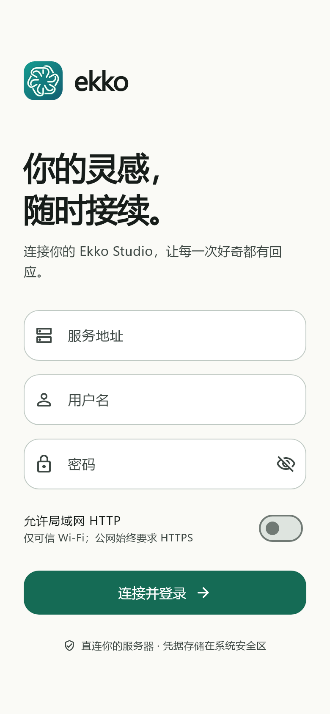
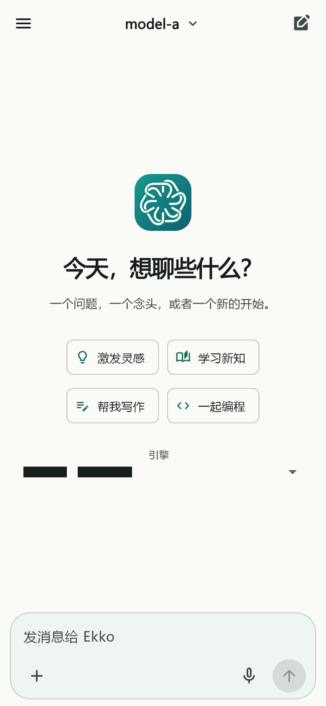
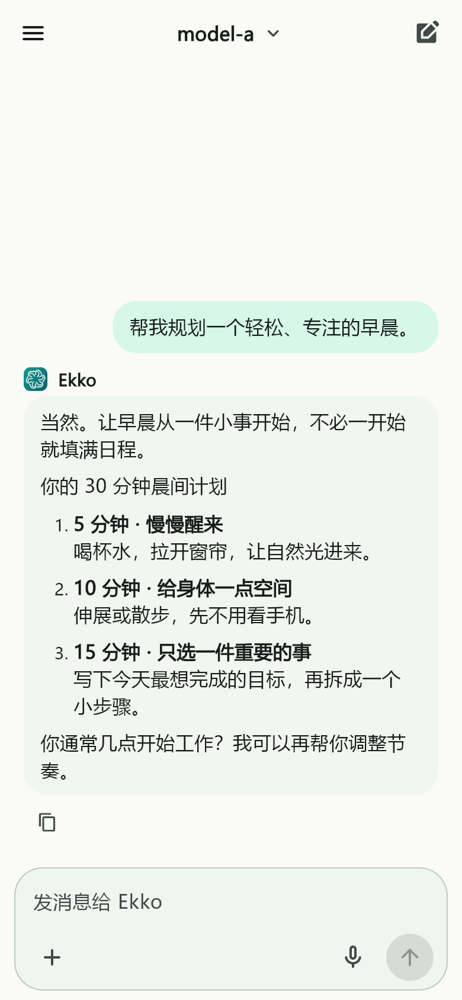
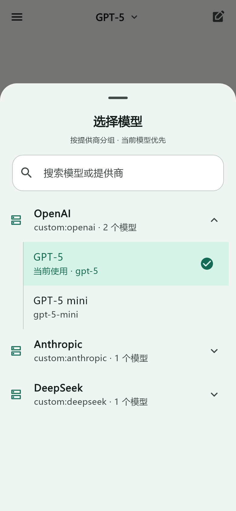
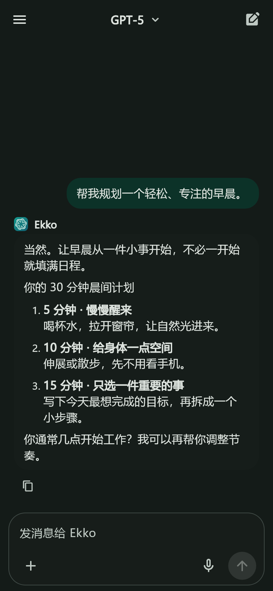

# Ekko Mobile

Android / iOS 上的轻量 Ekko Studio 客户端。面向 **hermes-studio v1.0.3** 的真实协议实现，Flutter 独立 UI，**不是 WebView 套壳**。

> 当前交付：双端源码、Android 已签名 Release APK、GitHub 双端构建及可选签名流程。Windows 本机已完成 Android 编译和真实服务协议联调；iOS 尚需 GitHub macOS Runner / Xcode 验证，不把未签名 `.app` 称为可安装 IPA。

## 功能

- 自定义服务地址，设备绑定账号密码登录、安全保存会话、过期退出。
- 个人信息、修改用户名/密码、退出登录、浅色/深色/跟随系统。
- Profile 切换，会话分页、搜索、重命名、二次确认删除。
- 新建会话，Ekko / Hermes / Codex 引擎选择；按提供商折叠分组的模型选择，当前提供商与模型置顶。
- 流式文字与折叠思考内容、停止生成、断线/前台恢复、消息复制、Markdown；用户/AI 使用淡色圆角背景区分，空白工具消息不显示头像。
- 原生文件与相册选择、图片发送前预览、附件移除；最多 5 个，单个 20 MB、总计 40 MB，点击发送才上传。
- 原生麦克风录音 → 当前 Profile 的服务端 STT → 可编辑草稿；最长 60 秒，取消/后台停止，不自动发送。
- 工具的一次性授权/拒绝、澄清问题；不支持的复杂会话仅供阅读。
- 移动端懒加载列表、40ms 流式刷新合并；生成中不反复解析 Markdown，不强制滚动打断阅读。

**范围边界：** 不提供终端、工作流编辑、群聊编辑、语音朗读/TTS 播放、实时语音通话、推送通知、离线聊天缓存、云中继授权码登录或模型密钥配置。模型密钥应在 Studio 网页端配置。本客户端没有收费模型调用的演示凭据。

## 界面预览

以下为真实 Flutter 组件渲染的设计预览（测试数据，不是真机截图）：

<p>
  
  
  
  
  
</p>

## 技术选择

Flutter **3.44.9** / Dart **3.12.2**，Material 3 + 平台输入法、系统安全存储、原生链接跳转。Release 下 AOT 编译，共享双端状态和协议实现。相比分别维护 Kotlin/Swift，本方案减少双端协议漂移；UI 是 Flutter 渲染，并非每个控件都是 UIKit / Android View。

- Android：**7.0+ / API 24+**，compile/target SDK 36，JDK 17。
- iOS：项目设置 **15.0+**，Swift Package Manager，签名打包需要 macOS + Xcode 和 Apple 开发者资料。
- 当前界面以简体中文为主；没有宣称完成真机帧率、能耗或全设备兼容性验证。

## 快速开始

```sh
flutter --version   # 使用 3.44.9
flutter pub get --enforce-lockfile
flutter analyze
flutter test --coverage
flutter run
```

启动后填写 **Studio 根地址**，例如 `https://studio.example.com`，而不是 `/api` 或网页子路径。使用 Studio 的用户名、密码登录。

- 公网必须 HTTPS，不能忽略证书错误。
- 局域网 HTTP 需主动勾选，仅允许私网/环回地址及 `.local` 主机名；仅在可信网络调试使用。
- 手机访问电脑需填电脑 LAN IP，不能填手机自身的 `localhost`。Android 模拟器访问宿主机通常用 `10.0.2.2`。
- 反向代理必须支持 `/socket.io/` 的 WebSocket upgrade，不能只转发 `/api`。
- 账号需拥有对应 Profile 权限；Hermes 引擎还需服务端 Hermes Runtime 正常。内置 Ekko 引擎不需要 Hermes Python Runtime。

**语音注意：** TTS 是语音合成，不能替代 STT。请在 Studio 当前 Profile 配置并激活服务端 STT；`browser` 识别不用于移动端。麦克风按钮在配置缺失时会说明原因，点击时重新检测配置。

**Codex 注意：** 需在服务端安装并配置 Codex；客户端只负责选择和协议接入，不会在手机执行 CLI。工作流/群聊/全局 Agent 会话仍只读。

详见 [服务配置](docs/server-setup.md)。

## Android 安装包

已整理好的交付包位于 `dist/ekko-mobile-1.0.1-android-release.apk` 和同名 `.aab`，校验值见 `dist/SHA256SUMS.txt`。

原始本地构建产物（被 Git 忽略，不作为源码提交）：

```text
build/app/outputs/flutter-apk/app-release.apk
build/app/outputs/bundle/release/app-release.aab
```

APK 可直接安装；AAB 用于商店上传，不能直接安装。本次本地签名资料在 `.local/signing/` 和 `android/key.properties`，**务必自行安全备份，禁止提交 Git**。以后覆盖安装需沿用同一签名；发布前可更换为你自己的正式签名身份。

```sh
flutter build apk --release
flutter build appbundle --release
```

没有 `android/key.properties` 时，Release 是**未签名**，不会悄悄使用 debug key。想不配置密钥先试用，可以 `flutter build apk --debug`。生产发布请遵循 [签名与自动出包](docs/build-release.md)。

## GitHub Actions

推送本仓库到 GitHub 后自动运行（无需把 Flutter / Android SDK 提交仓库）：

| 工作流 | 触发 | 产物 |
|---|---|---|
| `Mobile CI` | push / PR / 手动 | 测试覆盖率、可安装 debug APK、iOS 模拟器 app、iOS 未签名设备 app |
| `Signed packages` | 手动选择 android / ios / both | 签名 Release APK + AAB / IPA，需 `release` 环境 Secrets |
| `Studio contract` | 手动 | 固定源码版本的真实 REST + Socket.IO 联调，使用本地模型夹具 |

普通 PR 不读取生产签名密钥。建议为 GitHub 的 `release` Environment 配置审核人及允许发布的分支。这里提供可执行配置，**不表示已经在远端 Actions 上运行通过**；本地 Git 提交不会自动等同于推送。

## 目录

```text
lib/core/                 地址校验、LAN 策略
lib/data/                 REST、Socket.IO、安全存储、数据结构
lib/state/                控制器、可测试流式 reducer
lib/ui/                   登录 / 聊天 / 会话 / 个人信息
android/  ios/            平台工程与图标
test/                    单元、组件、可选真实服务契约测试
tools/mock-provider/     不调用外网模型的 OpenAI 兼容测试夹具
scripts/                 CI 签名、图标生成、源码分析工具
docs/analysis/           v1.0.3 源码分析及 CodeGraph 原始结果
.github/workflows/       双端质量检查及打包
```

## 验证、隐私和兼容性

- [测试记录与复现](docs/testing.md)
- [源码 / 协议分析](docs/analysis/source-analysis.md)
- [隐私说明](docs/privacy.md)
- [第三方与上游许可说明](THIRD_PARTY_NOTICES.md)

只持久化设备令牌、服务器/Profile、随机安装标识及主题，不保存密码或聊天正文。上游模型目录可能返回 Provider 密钥，本客户端不保留这些字段。模型内容、工具执行和数据保留最终由你连接的服务器负责。
