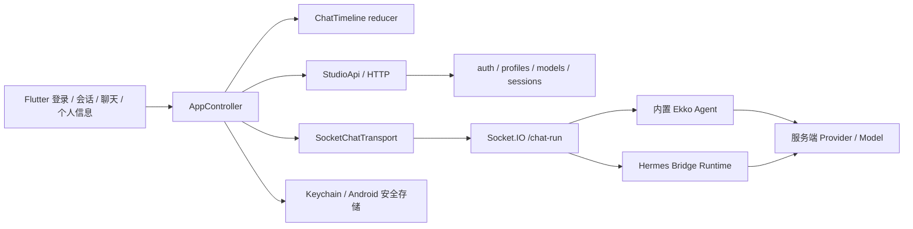

# 上游分析与客户端协议

## 版本与方法

- 仓库：`https://github.com/EKKOLearnAI/hermes-studio`
- 目标 tag：`v1.0.3`
- 校验 commit：`b44c74318fe5a0a1f3aed29d5095393964fc3d62`
- 注意该 tag 内 package.json 的 version 是 `0.7.18`，本项目按 tag/commit 锁定，而非据 package version 猜测。
- 阅读上游 AGENTS.md、DEVELOPMENT.md、ARCHITECTURE.md，重点人工核对 routes、controllers、Socket handler、客户端恢复逻辑和认证测试。
- 实际运行 `@lzehrung/codegraph@2.3.26` 的 orient / explore。原始 JSON 已保存于本目录，可通过 `scripts/analyze-upstream.ps1` 重现。

CodeGraph orient 报告 1874 个文件；这是混合解析图谱，不等于全量语义证明。import 解析含 regex fallback，关键路径仍以源码和真实请求验证。没有只凭代码图推断 REST URL。

## 关键源码位置

以下相对上游仓库根目录：

| 源码 | 核对内容 |
|---|---|
| `packages/server/src/modules/studio/routes/auth.ts`、`controllers/auth.ts` | 登录、me、凭据修改（App 与 Web 共用登录） |
| `packages/server/src/modules/hermes/controllers/profiles.ts` | listForApp / 账号可访问 Profile |
| `packages/server/src/modules/hermes/controllers/models.ts` | getAvailable / configured groups / api_mode |
| `packages/server/src/modules/studio/routes/sessions.ts`、`controllers/sessions.ts` | 会话搜索、消息分页、修改、删除 |
| `packages/server/src/modules/studio/sockets/chat-run.ts` | 握手鉴权、Profile、run 路由、resume / abort |
| `packages/server/src/modules/studio/services/chat-run/handle-ekko-agent-run.ts` | Ekko run、流式事件、持久化 |
| `packages/client/src/stores/hermes/chat.ts` | resumed 消息与在途 assistant 的重用语义 |
| `tests/server/app-connections-auth.test.ts`、`user-auth.test.ts` | 上游认证回归（本地 57 项通过） |

## 架构

客户端仅连接 Studio，不直接调用模型供应商，也不在手机启动 agent runtime。

## REST 契约

受保护请求：`Authorization: Bearer <JWT>`、`X-Hermes-Profile`。查询接口同时按上游约定传 `profile`。自动重定向关闭，避免令牌被转发到另一服务。

| 方法 / 路径 | 请求或关键返回 |
|---|---|
| POST `/api/auth/login` | username、password；返回 token、profiles、userId（App 与 Web 共用 JWT） |
| GET `/api/auth/me` | user（username / role / status / requiresCredentialChange） |
| GET `/api/app/profiles` | profiles 对象数组；使用 name |
| GET `/api/hermes/available-models` | groups、default、default_provider |
| GET `/api/studio/sessions` | offset、limit、profile；sessions / hasMore |
| GET `/api/studio/search/sessions` | q、limit、profile；results |
| GET `/api/studio/sessions/conversations/:id/messages/paginated` | offset、limit；messages / total / hasMore |
| POST `/api/studio/sessions/:id/rename` | title |
| DELETE `/api/studio/sessions/:id` | 删除服务端会话，不只是本地隐藏 |
| POST `/api/studio/sessions/:id/model` | model、provider、api_mode（非空时） |
| POST `/api/auth/change-password` | currentPassword / newPassword |
| POST `/api/auth/change-username` | currentPassword / newUsername |

模型选择使用 **groups**，不使用包含未配置供应商的 allProviders。过滤 disabled，显示 alias。上游目录返回可能携带 `api_key` / `base_url`；模型对象主动丢弃这些敏感字段，不缓存目录原始 JSON。

消息分页从数据库尾部取页，但页内返回时间正序；offset 计入隐藏的 tool 等所有行，不能仅按 UI 可见行递增。渲染识别 display_role/display_content 和序列化 content blocks。

## Socket.IO 契约与实际发现

- namespace：`/chat-run`；transport：WebSocket。
- auth：`{token}`；query：`{profile, platform: android|ios}`。
- `run`：input、session_id UUID、queue_id UUID、profile、model、provider、api_mode。
- **Ekko 首次 run 还要发送 `source: coding_agent` 与 `agent_id: ekko-agent`。** 只传 agent_id 会按默认 Hermes 来源处理，缺 Hermes Runtime 时失败。此问题由实际服务联调发现并修复。
- Hermes run 不传 Ekko source / agent_id，依赖服务器正常安装 Hermes Runtime。
- 没有臆造 HTTP 新建会话接口；第一次 run 创建会话。
- 事件：run.started、message.delta、reasoning.delta、run.completed、run.failed、run.peer_user_message。
- 恢复：发送 `resume {session_id}`，处理 resumed 的 messages、events、isWorking、messageLoadedCount、hasMoreBefore。
- 停止：`abort {session_id}`；终止响应名是 **abort.completed**。
- 交互：approval.requested/resolved、approval.respond；clarify.requested/resolved、clarify.respond。授权仅提供 once / deny，不提供全局永久授权。

**Socket.IO recovery 参数：** 服务启用 connection-state recovery，会将恢复 offset 追加为第二个事件参数；Dart catch-all 回调此时得到 `[payload, offset]`，不能直接当 Map。transport 统一解包，已添加回归测试。

**快照与 replay：** Hermes 快照可能已包含部分 assistant 文本，Ekko 快照可能只有 user，增量留在 events。reducer 依据 runMarker / finish_reason 重用在途 assistant，避免快照文本再拼接 replay 后重复；若无在途快照则重放最新 run。收到 resumed 会作废过期历史请求并释放 loading 标志。

发送仅在在线、非恢复中且没有在途运行时允许。重连只 resume，**不自动重发 run 或工具授权**。状态 epoch 隔离退出、切 Profile、切会话后的迟到响应；session_id / run_id 过滤串会话事件。

## 已验证与边界

真实 v1.0.3 服务 + 本地 OpenAI-compatible SSE 夹具，使用实际 Dart HTTP / Socket.IO 客户端完成登录、模型目录、新建流式 run、历史、重命名、模型写入、搜索、完成恢复、运行中断线恢复、abort 和删除。没有使用外部付费模型、没有据此宣称 Hermes Python Runtime 或全部工具生态已端到端验证。

## v1.0.1 移动端修订：Codex / STT / 附件

以下为同一 v1.0.3 SHA 的本地源码核对，不依赖猜测的 OpenAI 或聊天兼容接口：

- `packages/client/src/api/coding-agents.ts`：GET `/api/coding-agents` 返回 `tools[]`，Codex ID 是 `codex`，安装标记为 `installed`。`handle-coding-agent-run.ts` 接受 `source: coding_agent`、`agent_id: codex`、`mode: scoped`；模型与 api_mode 使用同一 Profile 配置。移动端只支持 scoped 对话，不开放 global 模式。
- `modules/studio/controllers/stt.ts`：GET `/api/studio/stt/profile-status` 返回 `configured` 与 `activeProvider`，不需要读取 STT Secrets。POST `/api/studio/stt/transcribe` 使用 multipart 字段 `audio`、`provider`；响应 `text`。`browser` 不是移动端可用的服务端识别提供商。客户端录制单声道 16 kHz WAV，最长 60 秒。
- `modules/studio/controllers/upload.ts`、Web store `uploadFiles` / `buildContentBlocks`：POST `/api/studio/uploads`，重复 multipart `file` 字段，返回 `files[{name,path}]`。Socket run 的 `input` 使用 `{type:text,text}` 与 `{type:image|file,name,path,media_type}`，不是直接传手机文件路径，也不是自行发明 attachments 字段。
- `services/chat-run/content-blocks.ts`：服务端把上传后的图片路径转换为原生图片输入，把文档路径交给 Agent 工具。移动端在历史序列化内容块中保留图片/文件名称，不把工具块当作正文。
- 默认通用上传总量上限 50 MB（含 multipart）；移动端主动限制单文件 20 MB、总计 40 MB / 5 个，为请求封装留余量。失败不自动提交 run，取消后不自动重试。
- 父子模型树按 provider ID 分组（不是按可能重复的展示名称）；当前模型即使不在新目录中也显示在当前提供商下。搜索保留父级；渲染仍为懒加载，展开大量模型不一次性创建全部控件。

## 1.0.4：附件读取与工具、测试隔离

- `controllers/download.ts` 支持 GET `/api/studio/files/download`，参数 `path`、`name`，`variant=app-image` 可请求服务端优化图片；上游选择上传目录本地 provider 或当前 Profile file provider。客户端始终构造原 Studio 域名的受鉴权请求、不跟随重定向，不直接访问返回路径/外部 URL；读取超时、大小限制与会话切换检查都在客户端。
- `handle-ekko-agent-run.ts` 的 `tool.started` / `tool.completed` / `tool.failed` 使用 `tool_call_id`、`name` / `tool`。客户端按 ID 去重，仅保存操作名与状态，不将命令、参数、结果日志展开为正文。历史 tool_calls 缺失完成信息时只标记“已调用”，不猜测成功。
- `infrastructure/database/index.ts`：开发模式数据库目录固定为 cwd 下 packages/server/data；测试模式可用 `HERMES_WEB_UI_TEST_DB_DIR` 覆盖。本轮本地与 CI 配置同时明确 `NODE_ENV=test`，补全数据库隔离。

## 1.0.5：思考深度与多会话事件

- `controllers/sessions.ts` 的 `SESSION_REASONING_EFFORTS` 接受空字符串（默认）及 `none/minimal/low/medium/high/xhigh/max`；POST `/api/studio/sessions/:id/reasoning-effort` 使用 `reasoningEffort`，变更模型会重置该值。移动端与 Web `ChatInput.vue` 使用一致档位，不承诺每个模型都实现每一档。
- Socket run 使用 `reasoning_effort`；`handle-ekko-agent-run.ts`、`handle-coding-agent-run.ts` 读取这个字段，`chat-run.ts` 传给 Hermes 桥接；`resumed` 返回 `reasoning_effort`、model/provider/api_mode。移动端按返回的会话 ID 更新对应配置，不能更新别的聊天。
- `/chat-run` 连接时服务器发送 `session.activity.snapshot`（当前 Profile 的 sessions 数组，包含 session_id/status），之后通过 `session.activity` 更新 running/completed/failed，携带 timestamp。权限/澄清事件也通过 Profile 房间广播。
- `resume` 经会话/Profile 授权后执行 `socket.join(session:<id>)`，没有自动 leave 先前房间，所以同一连接可以继续接收之前会话的输出。客户端用 Profile + session_id 路由并缓存，而非仅保留当前 timeline。
- 客户端断线只恢复订阅/resume，不重发 run 或授权；多个任务的确认/同步超时定时器绑定各自会话。活动快照缺项先标记待同步并 resume，不当成任务已完成；旧时间戳状态事件与迟到历史响应不会覆盖新的运行状态。
- 新增真实 Studio + 本地模型夹具测试：两个独立登录会话同时工作、另一个客户端从快照发现运行任务、切回 A 不影响 B 完成、只停止 A、会话 reasoning-effort 修改后重连仍保留。尚未运行真实 Codex CLI/收费模型并行验收。
